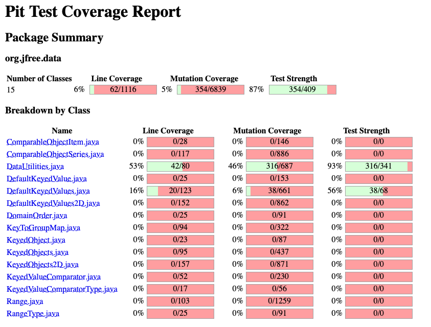
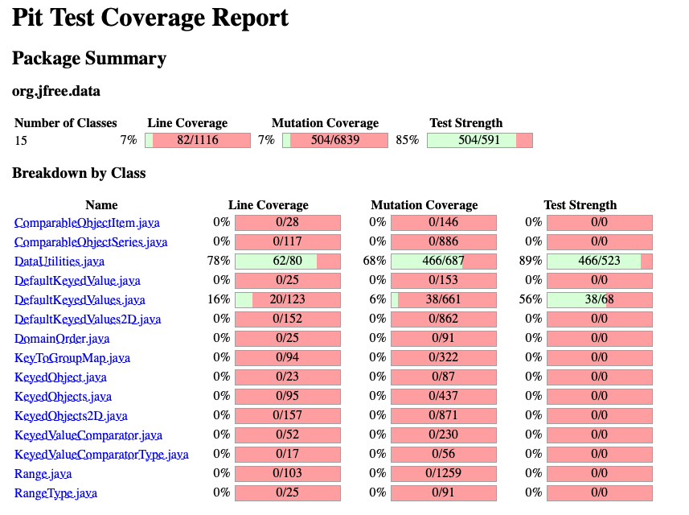

**SENG 438 - Software Testing, Reliability, and Quality**

**Lab. Report \#4 – Mutation Testing and Web app testing**

| Group \#:      |     |
| -------------- | --- |
| Student Names: | Carter Boucher    |
|                | Ayo Olabode    |
|                | Maheen Hossain   |
|                | Jason Wu    |

# Introduction
The main focus of this lab was to familiarize ourselves with mutation testing and GUI testing through the SeleniumIDE. We were tasked with creating a test suite for the Range.java and DataUtilities.java classes in order to increase the mutation coverage. We then used the SeleniumIDE to create test scripts for the Amazon.ca website.

# Analysis of 10 Mutants of the Range class 

# Report all the statistics and the mutation score for each test class

__DataUtilites Original Coverage__

__DataUtilites New Coverage__

# Analysis drawn on the effectiveness of each of the test classes

__DataUtilities Analysis__

For the data utilities class we were able able to increase the mutation coverage by 22% 

# A discussion on the effect of equivalent mutants on mutation score accuracy
A mutant is considered "killed" if it produces different outputs while executing the same test case as the original program. Otherwise, it is deemed to have "survived." The accuracy of the mutant score reflects the test case's fault detection capability, with a higher number of killed mutants indicating a stronger test case. However, the problem of equivalent mutants has created issues in mutation testing. As equivalent mutants exhibit the same behavior as the original program, they cannot be killed by the test set, resulting in an inaccurate representation of the mutant score accuracy, this means that the total mutation coverage will be skewed.

# A discussion of what could have been done to improve the mutation score of the test suites
The mutation coverage score is based on whether the mutants survive or are killed by the tests we had created in the earlier lab. For Range.java since it was a bigger file, it had more mutants. To improve the score of this, we had created additional tests to kill different types of mutants. For DataUtilities.java we created aditional test cases to cover functions that were not fully tested before.

# Why do we need mutation testing? Advantages and disadvantages of mutation testing
Mutation testing is a crucial aspect of the Software Development life cycle, as it provides an extra level of confirmation for the test suite we create. The presence of mutants in our code allows us to test if the test suite can effectively identify and eliminate different conditions and variable values within the statements, resulting in a more robust test suite for our source code. While each testing coverage tool we've learned about has its advantages and disadvantages, mutation testing offers a range of benefits, such as the thorough verification and validation of test cases, and the creation of unique test cases to comprehensively detect faults in the classes. This method does have drawbacks, it cannot guarantee that the mutant will be resolved in every situation within the source code since it only verifies the conditionals and not the logic implementation. Additionally, larger source codes can result in a vast number of mutants that may confuse the test developer about the purpose of each mutant. Lastly, mutation testing can be time-consuming and potentially costly for companies operating on a tight budget, depending on the project requirements.

# Explain your SELENUIM test case design process

# Explain the use of assertions and checkpoints

# how did you test each functionaity with different test data

# Discuss advantages and disadvantages of Selenium vs. Sikulix

# How the team work/effort was divided and managed
All of the team work and effort was divided equally among the 4 group members, so that each member was able to do hands-on work with the mutations and Selenium. We divided the work so that two members worked on dataUtilities, and the other two members worked on range. For the Selenium portion we divided it so each member created 2 scripts to test amazon.ca.

# Difficulties encountered, challenges overcome, and lessons learned
We experienced difficulties in navigating the both the mutation tools and SeleniumIDe used for this lab. As it was our first time using them, we experienced a significant learning curve in experimenting with them, and understanding the most effective one to use. We overcame these challenges by reading through source documentation and experimenting through trial and error, in order to understand which tool to use.

# Comments/feedback on the lab itself
Altogether, this lab was a great way for us to utilize the concepts regarding code and control flow coverage in a practical learning environment. We now feel comfortable with applying the skills learned from the lab in real world situations.