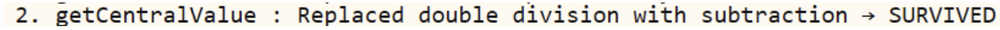

**SENG 438 - Software Testing, Reliability, and Quality**

**Lab. Report \#4 – Mutation Testing and Web app testing**

| Group \#:      |     |
| -------------- | --- |
| Student Names: | Carter Boucher    |
|                | Ayo Olabode    |
|                | Maheen Hossain   |
|                | Jason Wu    |

# Introduction
The main focus of this lab was to familiarize ourselves with mutation testing and GUI testing through the SeleniumIDE. We were tasked with creating a test suite for the Range.java and DataUtilities.java classes in order to increase the mutation coverage. We then used the SeleniumIDE to create test scripts for the Amazon.ca website.

Note: test files in JFreeChart4/src/org/jfree/data/test

# Analysis of 10 Mutants of the Range class 
Survives:

For our scale method these mutants survived on one of the LOC because our test cases did not involve checking values within the range of -1 to 1. This means that these survive because all our test cases were values greater than the range of 1, example is scale by 2 gets unchecked and thus the mutant survives.

For our original test case involving getCentralValue() we had a lower boundary value set to 4 and since the formula is (lower bound % 2), (4 % 2 = 2) gave the same value as (4 - 2 = 2) after the division was replaced with subtraction.

These mutants survived because our original test suite with the test cases for scale did not involve any test cases where we used a scale factor equal to or less than 0 and as such these mutants survived.
Killed:

These mutants are killed because our test case for hashCode compares the result exactly and if the right shift value is changed from 32, the output will be different than the asserted value and thus the mutant is killed.

For our equals() method, our test cases killed these mutants because if a range object is not equal to another and these equality checks are changed the return function will return the wrong boolean and fail the assert.

Our expand() test cases involved multiple different input data and had assert statements on each test case to ensure correct output and if any of the arithmetic operators were mutated, the test cases would fail the assert and be killed.

Added Test Cases:

    @Test
    public void testExpandLowerBoundAboveUpper() {
    Range range1 = new Range(9, 10);
    Range testResult = Range.expand(range1, 5, -7);
    assertTrue(testResult.getLowerBound() == 3.5);
    }

    We noticed a section with no coverage because our original test suite did not have a test case to test when lower > upper within the expand() function and this test case increased coverage and killed some mutants.

    @Test
    public void testScaleWithZero() {
    Range range1 = new Range(5, 10);
    Range testResult = Range.scale(range1, 0);
    assertTrue(testResult.getLowerBound() == 0);
    }

    @Test(expected = IllegalArgumentException.class)
    public void testScaleWithBelowZero() {
    Range range1 = new Range(5, 10);
    Range testResult = Range.scale(range1, -0.5);
    }

    @Test
    public void testScaleWithAboveZero() {
    Range range1 = new Range(5, 10);
    Range testResult = Range.scale(range1, 0.5);
    assertTrue(testResult.getLowerBound() == 2.5);
    }

    These test cases increased mutant coverage by killing mutants that survived because our test suite did not test cases where factor < 0. By checking the logs and seeing mutants where 0 is replaced by -1 or 1, we used factor inputs of 0.5 and -0.5 to make sure those mutants are killed.	

    @Test
    public void testCentralValue() {
    Range range1 = new Range(5, 11);
    double testResult = range1.getCentralValue();
    assertTrue(testResult == 8);
    }

This test case originally had input data that was Range range1 = new Range(4,10). This set of input data allowed a mutant that replaced the division within the function to a subtraction. The original function calculated (4 % 2) and the mutant calculated (4 - 2) which coincidentally resulted in the same value and as such replacing the data increased coverage.

# Report all the statistics and the mutation score for each test class

__Range Original Coverage__

__Range New Coverage__

__DataUtilites Original Coverage__

__DataUtilites New Coverage__

# Analysis drawn on the effectiveness of each of the test classes

__Range Analysis__

Our updated Range was only able to get a mutation coverage of 73% because our original range mutation coverage was already very high at 66%. Most of the remaining surviving mutants are invalid mutants and cannot be killed or do not matter even if they are killed.

__DataUtilities Analysis__

For the data utilities class we were able able to increase the mutation coverage by 22% 

# A discussion on the effect of equivalent mutants on mutation score accuracy
A mutant is considered "killed" if it produces different outputs while executing the same test case as the original program. Otherwise, it is deemed to have "survived." The accuracy of the mutant score reflects the test case's fault detection capability, with a higher number of killed mutants indicating a stronger test case. However, the problem of equivalent mutants has created issues in mutation testing. As equivalent mutants exhibit the same behavior as the original program, they cannot be killed by the test set, resulting in an inaccurate representation of the mutant score accuracy, this means that the total mutation coverage will be skewed.

# A discussion of what could have been done to improve the mutation score of the test suites
The mutation coverage score is based on whether the mutants survive or are killed by the tests we had created in the earlier lab. For Range.java since it was a bigger file, it had more mutants. To improve the score of this, we had created additional tests to kill different types of mutants. For DataUtilities.java we created aditional test cases to cover functions that were not fully tested before.

# Why do we need mutation testing? Advantages and disadvantages of mutation testing
Mutation testing is a very in-depth testing method. Since it requires a large amount of test cases, it often provides more coverage and testing of code than offered by other testing methods. However, this also leads to a huge disadvantage, which is that it is extremely time consuming, which can incur added costs to the testing. Therefore, it should be used when the software tester has a large amount of time and resources to test. Mutation testing also may result in equivalent mutants which give the appearance of different bugs due to syntax, but are actually equivalent to the original program. Hence, the tester must be very experienced in mutation testing to be able to overcome this issue.

# Explain your SELENUIM test case design process
- To develop an effective Selenium test case, we followed a systematic approach. Firstly, we identified the key functionalities and features of the system we wanted to test. For this, we chose Amazon.ca, as it is a complex system with multiple features and functionalities.
- Next, we listed down the different user flows and paths within the system that were critical to test. We focused on the user paths that were frequently used by customers and those that had the potential to impact the user experience significantly. For instance, we included scenarios such as user login, account creation, product search, and purchase checkout.
- After identifying the user paths, we began mapping out the various test cases that were required to cover each path. We prioritized the test cases based on their criticality and the likelihood of defects arising in the feature. We also included negative test cases, such as boundary value analysis and error handling, to ensure comprehensive testing.
- Once the test cases were mapped out, we created scripts using Selenium to automate the testing process.

# Explain the use of assertions and checkpoints
Assertions and checkpoints are key features in Selenium testing. Assertions are used to verify the expected behavior or output of an element or behavior in the application, while checkpoints are used to verify the presence or absence of specific elements or conditions on a web page. By comparing actual and expected values, assertions detect whether an application is functioning as intended, while checkpoints ensure that the application's user interface is functioning correctly. These tools help detect defects early in the testing process, improve code quality, and increase overall test coverage.

# how did you test each functionaity with different test data
During the testing of Amazon.ca, we utilized the "Value" field in Selenium to test each functionality with different test data. By changing the input data, we were able to verify that the test case behaved as expected. In cases where the input data affected subsequent actions, such as selecting a store location, we created separate test cases to cover different inputs and outputs. For example, we created separate test cases for logging in with a correct and incorrect username to capture and verify the different outputs.

# Discuss advantages and disadvantages of Selenium vs. Sikulix
Ultimately, the selection of the most appropriate tool for testing and automating web applications between Selenium and SikuliX depends on the project's specific requirements and objectives. Selenium is an open-source tool with an active community, providing robust testing capabilities and cross-browser compatibility. In contrast, SikuliX employs visual recognition, enabling easy use for non-programmers and efficient testing of non-HTML elements such as desktop applications. Nonetheless, SikuliX has limited browser compatibility and is not open source, while Selenium demands a certain level of technical proficiency to use effectively.

# How the team work/effort was divided and managed
All of the team work and effort was divided equally among the 4 group members, so that each member was able to do hands-on work with the mutations and Selenium. We divided the work so that two members worked on dataUtilities, and the other two members worked on range. For the Selenium portion we divided it so each member created 2 scripts to test amazon.ca.

# Difficulties encountered, challenges overcome, and lessons learned
We experienced difficulties in navigating the both the mutation tools and SeleniumIDe used for this lab. As it was our first time using them, we experienced a significant learning curve in experimenting with them, and understanding the most effective one to use. We overcame these challenges by reading through source documentation and experimenting through trial and error, in order to understand which tool to use.

# Comments/feedback on the lab itself
Altogether, this lab was a great way for us to utilize the concepts regarding code and control flow coverage in a practical learning environment. We now feel comfortable with applying the skills learned from the lab in real world situations.